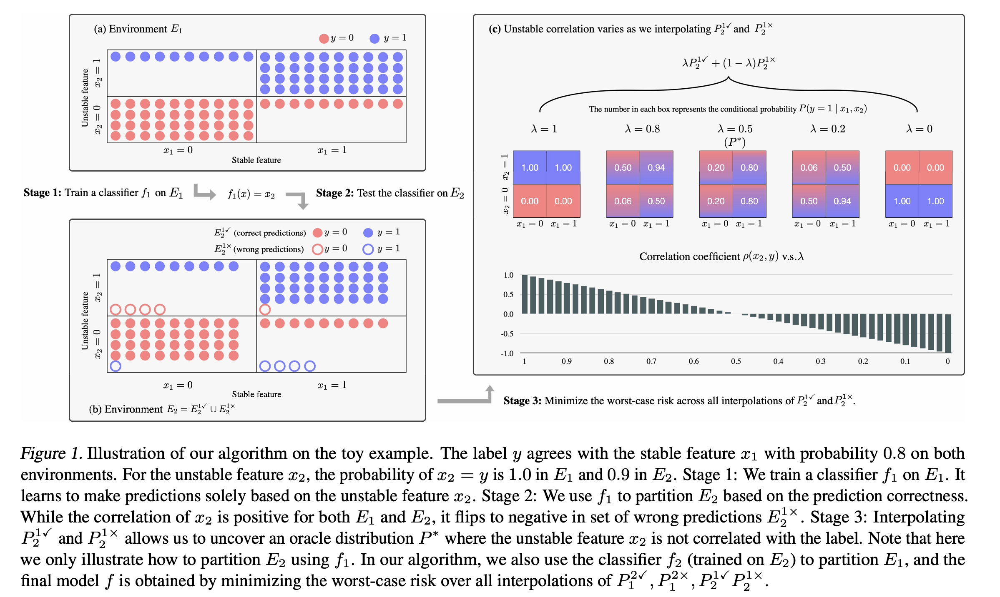

# Predict-then-Interpolate

🥧 This repository contains the code and data for our ICML 2021 paper:

🥧 *[Predict, then Interpolate: A Simple Algorithm to Learn Stable Classifiers](https://arxiv.org/pdf/2105.12628.pdf)*. Yujia Bao, Shiyu Chang and Regina Barzilay.

🥧 If you find this work useful and use it on your own research, please cite our paper.

```
@inproceedings{bao2021predict,
  title={Predict then Interpolate: A Simple Algorithm to Learn Stable Classifiers},
  author={Bao, Yujia and Chang, Shiyu and Barzilay, Regina},
  booktitle={International Conference on Machine Learning},
  year={2021},
  organization={PMLR}
}
```


## Overview

Our goal is to learn correlations that are stable across different training environments. Our algorithm consists of three stages:
1. For each training environment , train a classifier .
2. For each pair of training environments  and , use the classifier  to partition : ,
where :  contains examples that are predicted correctly and :  contains examples that are misclassified by : .
3. Train the final model by minimizing the worst-case risk over all interpolations of the partitions.

<p align="center">

</p>

## Data
Datasets should be put under the directory `datasets/`.
We ran experiments on a total of 4 datasets. MNIST and CelebA can be directly downloaded from the PyTorch API. For beer review and ASK2ME, due to liscense issues, you may contact me ([yujia@csail.mit.edu](yujia@csail.mit.edu)) for the processed data.

### Quickstart
`.bin/` contains all the scripts for running the baselines and our algorithm.

## Code
`src/main.py` is our main file.
- `src/train_utils` loads the training algorithm specified by the method argument.
- `src/data_utils` loads the dataset specified by the dataset argument.
- `src/model_utils` loads the network specified by the method and the dataset arguments.
- `src/training/` contains the training and testing routine for all methods.
- `src/data/` contains the data pre-processing and loading pipeline for different datasets.
- `src/model/` contains the networks that we used for different datasets.

## Dependencies
`package-list.txt` contains all the packages that are related to the project.
To install them, simply create a new [conda](https://docs.conda.io/en/latest/) environment and type
```
conda install --file package-list.txt
```

## Acknowledgement

Research was sponsored by the United States Air Force Research Laboratory and the United States Air Force Artificial Intelligence Accelerator and was accomplished under Cooperative Agreement Number FA8750-19-2-1000. The views and conclusions contained in this document are those of the authors and should not be interpreted as representing the official policies, either expressed or implied, of the United States Air Force or the U.S. Government. The U.S. Government is authorized to reproduce and distribute reprints for Government purposes notwithstanding any copyright notation herein.
